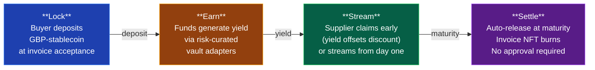
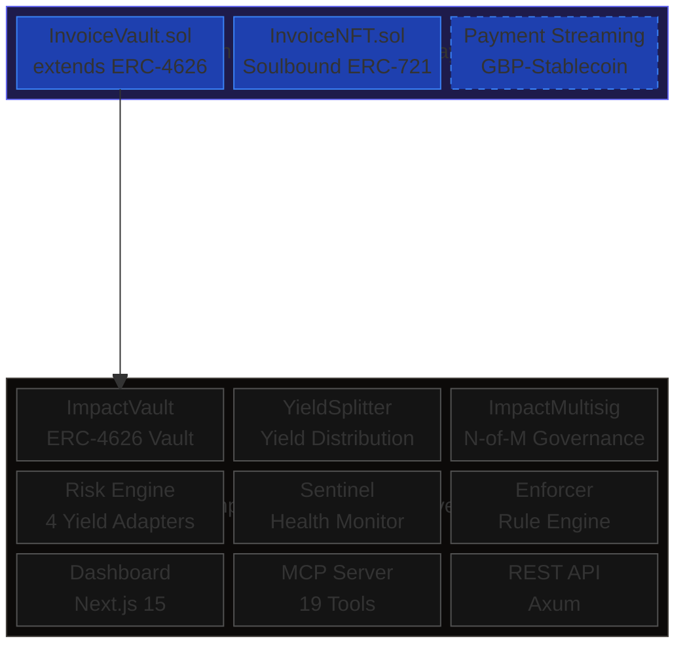
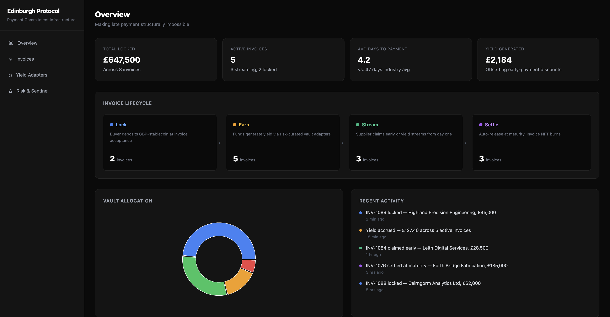
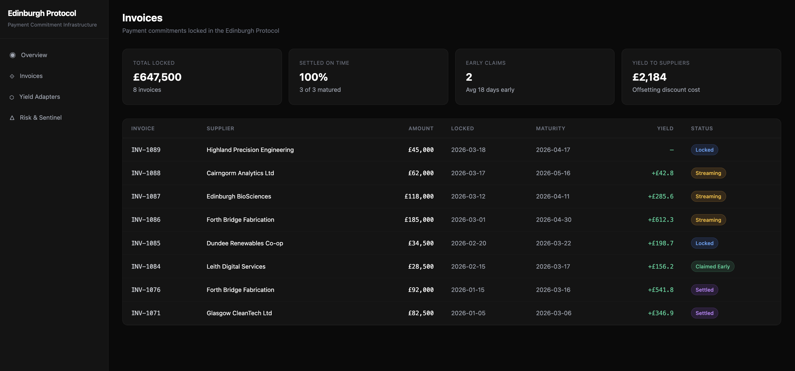
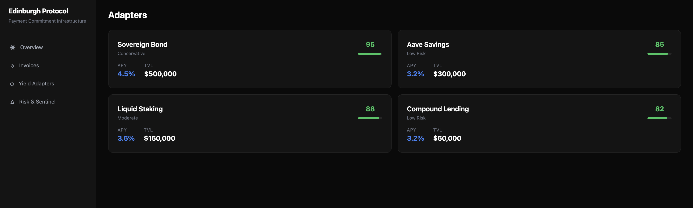
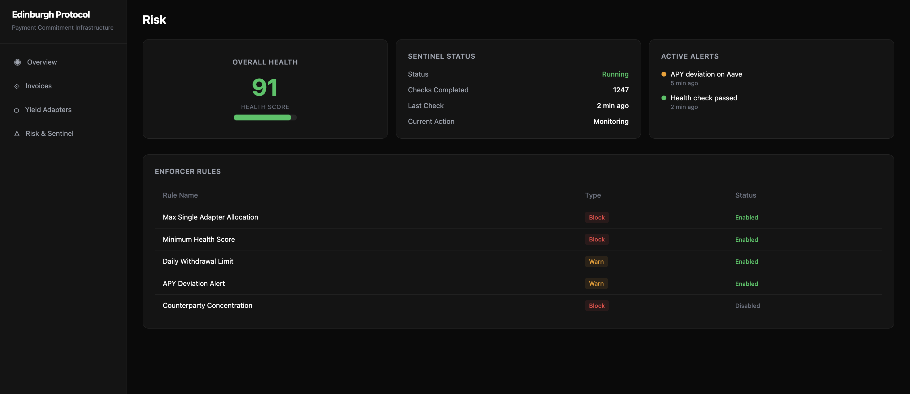

# The Edinburgh Protocol

**Scotland's open-source payment commitment infrastructure. Making late payment structurally impossible.**

The Edinburgh Protocol is a fork of [ImpactVault](https://github.com/fabio-rovai/ImpactVault), repurposed for B2B trade finance. It transforms an ERC-4626 yield vault into payment commitment infrastructure where buyers lock funds at invoice acceptance, suppliers earn yield from day one, and settlement is enforced by smart contract — not by goodwill.

---

## The Problem

Late payment is a structural failure in Scottish business:

- **61.3% of Scottish invoices are paid late** (FreeAgent analysis, Scottish Financial News, October 2025)
- The Scottish Government's 10-day prompt payment policy cannot self-enforce across supply chains
- Late payment costs Scottish SMEs an average of **£22,000 per year** in lost productivity, borrowing costs, and administrative burden
- Voluntary payment codes and naming-and-shaming have not shifted the needle

The root cause is simple: payment terms are promises, not commitments. There is no mechanism to make payment structurally unavoidable once an invoice is accepted.

## How It Works



1. **Lock** — Buyer deposits GBP-stablecoin into the InvoiceVault at invoice acceptance. A soulbound InvoiceNFT is minted to the supplier as proof of commitment.
2. **Earn** — Locked funds generate yield through ImpactVault's risk-curated adapter system (sovereign bonds, Aave, Lido, Compound).
3. **Stream** — The supplier can claim payment early at any point. Yield earned during the lock period offsets the early-payment discount, reducing the cost of faster access to cash.
4. **Settle** — At maturity, anyone can trigger settlement. The full amount is released to the supplier and the InvoiceNFT is burned. No human approval required.

## Architecture



### Inherited from ImpactVault

The full ImpactVault codebase is preserved and operational:

- **ERC-4626 Vault** — Whitelisted deposit vault with 2-day timelock on parameter changes and emergency derisk
- **4 Yield Adapters** — Sovereign bonds, Aave V3, Lido wstETH, Compound V3 — each implementing a common `YieldAdapter` trait
- **Risk Engine** — Weighted allocation across risk spectrum (Sovereign → StablecoinSavings → LiquidStaking → DiversifiedLending) with concentration limits
- **Sentinel** — Continuous health monitoring with auto-derisk triggers
- **Enforcer** — Rule engine with sliding-window conditions (derisk-on-health-breach, oracle staleness, concentration limits)
- **Governance** — N-of-M multisig with 2-day timelock, single-signer emergency derisk
- **MCP Server** — 19 tools across vault, adapter, sentinel, risk, DPGA, enforcer, lineage, and pattern categories
- **REST API** — Health, adapters, vault status, risk assessment, sentinel, yield history, disbursements
- **Dashboard** — Next.js 15 with TVL overview, adapter health cards, risk gauge, disbursement history
- **Lineage** — Immutable audit trail with session tracking and causal chains
- **164 tests** — 139 Rust integration tests + 25 Solidity tests

### New / Under Development

- **InvoiceVault.sol** — Extends ImpactVault with `lockPayment`, `claimEarly`, `settle`, and `getInvoiceStatus`
- **InvoiceNFT.sol** — Soulbound ERC-721 minted on payment lock, burned on settlement. Stores invoice metadata on-chain.
- **Payment streaming** — Continuous yield streaming to suppliers (planned)
- **GBP-stablecoin integration** — Integration with FCA-regulated GBP stablecoins (planned, aligned with FCA sandbox 2026)

## Dashboard

The Edinburgh Protocol includes a real-time dashboard for monitoring invoice commitments, yield generation, and vault health.









## Quick Start

### Prerequisites

- Rust 1.80+
- [Foundry](https://book.getfoundry.sh/getting-started/installation) (latest)
- Node.js 18+ and npm 9+ (for dashboard)

### Build and Test

```bash
# Clone
git clone https://github.com/fabio-rovai/edinburgh-protocol.git
cd edinburgh-protocol

# Build Rust backend
cargo build --release

# Run Rust tests (139 tests)
cargo test

# Build and test Solidity contracts (25+ tests)
cd contracts
forge build
forge test -vvv
```

### Run the Stack

```bash
# Initialise database
cargo run --release -- init

# Start MCP server (stdio)
cargo run --release -- serve

# Start REST API (port 3000)
cargo run --release -- api

# Start dashboard (port 3001)
cd dashboard && npm install && npm run dev
```

## Contract Interfaces

### InvoiceVault

```solidity
// Lock payment at invoice acceptance — mints InvoiceNFT to supplier
function lockPayment(uint256 invoiceId, address supplier, uint256 maturityDate, uint256 amount) external;

// Supplier claims early — yield offsets discount
function claimEarly(uint256 invoiceId) external;

// Auto-release at maturity — burns InvoiceNFT
function settle(uint256 invoiceId) external;

// Query invoice state
function getInvoiceStatus(uint256 invoiceId) external view
    returns (InvoiceStatus status, address buyer, address supplier, uint256 amount, uint256 maturityDate);
```

### InvoiceNFT

Soulbound ERC-721. Non-transferable. Minted by InvoiceVault on `lockPayment`, burned on `settle` or `claimEarly`.

Each token stores: `amount`, `supplier`, `maturityDate`, `vaultAddress`.

## Context

Built for the **Digital Trust Centre of Excellence Innovation Challenge 2** at Edinburgh Napier University.

Aligned with:
- **FCA stablecoin sandbox 2026** — regulated GBP-stablecoin settlement
- **FinTech Scotland DLT Centre of Excellence** — distributed ledger infrastructure for Scottish financial services
- **Scottish Government prompt payment policy** — 10-day payment target for public sector supply chains

## License

MIT — same as ImpactVault.
